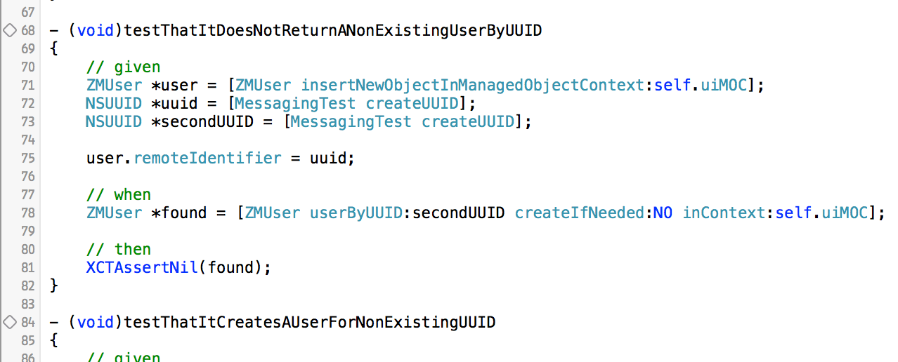
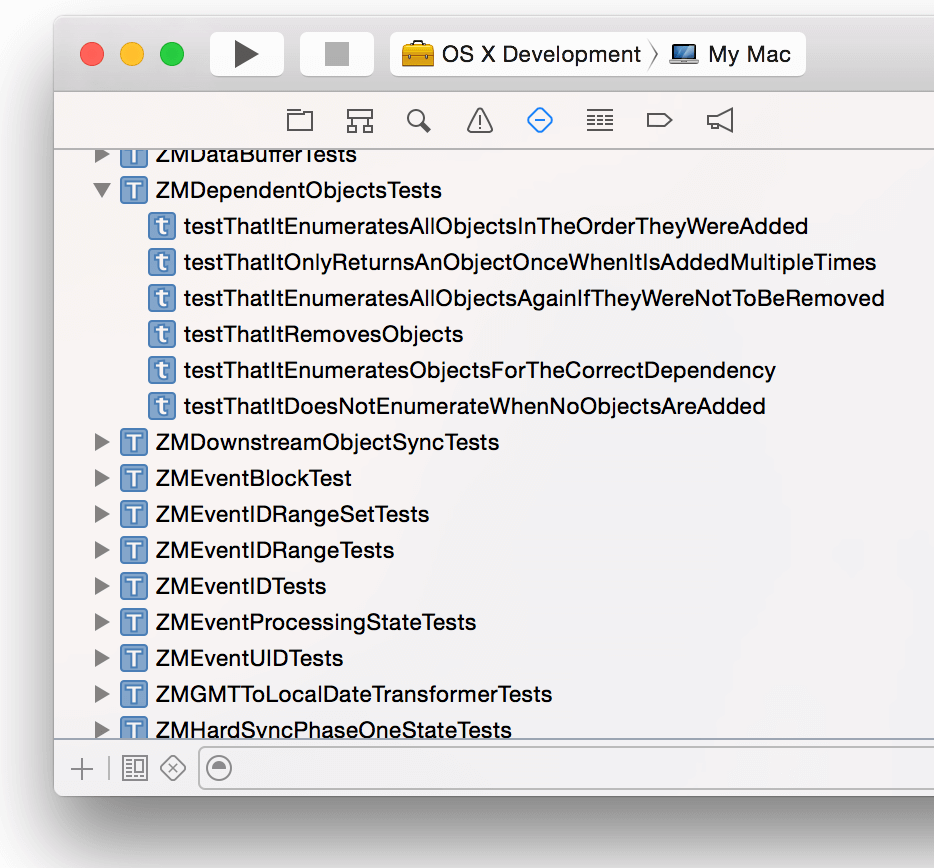
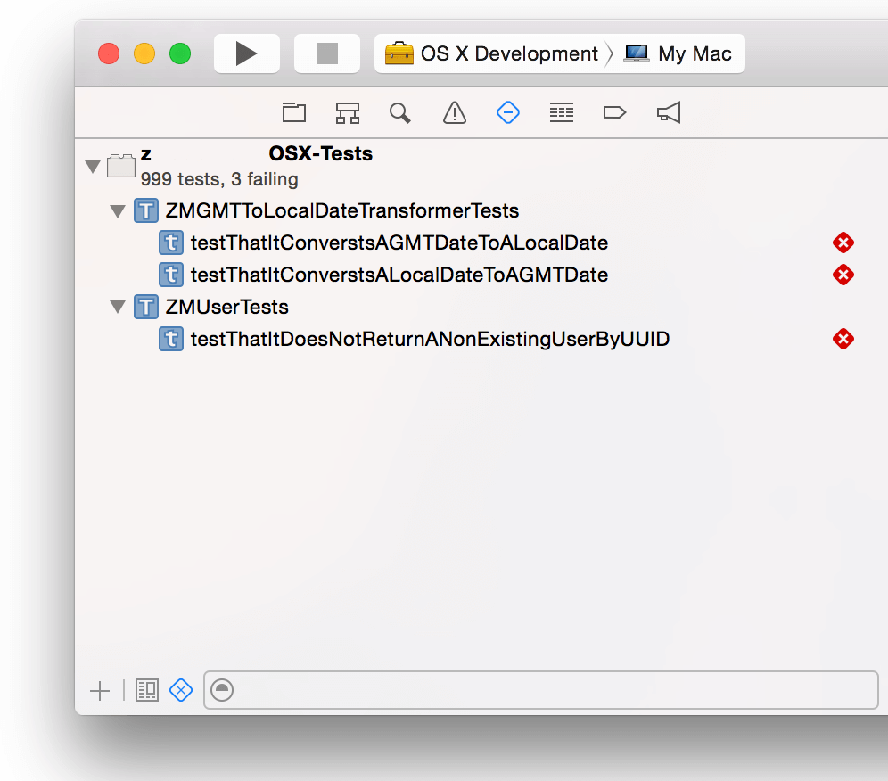

差不多四个月以前，我们团队 (Marco, Arne 和 Daniel) 开始着手为我们的新应用写模型层。我们想在开发中使用测试，经过一番讨论之后，我们选择 [XCTest](https://developer.apple.com/library/prerelease/ios/documentation/DeveloperTools/Conceptual/testing_with_xcode/Introduction/Introduction.html) 作为我们的测试框架。

目前为止，我们的编码库已经纵横 190 个文件和 18,000 行代码，达到了 544 kB。我们测试部分的代码现在差不多有1,200 kB，大概有被测试代码的两倍。虽然我们还没有完全结束这个项目，但是已经接近尾声。在这里我们想和大家分享在这过程中我们所学到的东西，包括一般性的测试和如何用 XCTest 来做测试。

这里需要注意的是在文章中提到的一些模型类和方法已经被重命名了，因为这个项目还没有在 App Store 中上线。

我们选择 XCTest 作为我们的测试框架是因为它非常简单并且与 Xcode 的 IDE 直接集成。通过这篇文章，我们想对于何时 XCTest 会是测试框架中的好的选择，以及何时你们可能会选择其他的框架这一问题作出一些阐释。

我们还在文章中合适的地方添加了[这个话题里](http://objccn.io/issue-15/)的其他文章的链接。

## 为什么我们需要测试

就像[这篇关于糟糕的测试的文章](http://objccn.io/issue-15-4)中提到的那样，很多人都认为“只有当我们的改变代码时，测试才能产生回报。” 如果你有这样的想法，你应该仔细读读那篇文章，因为显然通过测试你所能获得的比这要多。有一点是非常重要的，就算我们在写代码的最早版本，我们还是会将大部分时间花在修改代码上 -- 随着项目的发展，越来越多的功能会被加进来，我们会发现很多地方都需要稍微改一下。所以即使你还没有在做 1.1 或 2.0 版本，但你还是要做大量的修改，而测试正是在这时为我们提供不可估量的帮助。

我们依然还在完成我们框架的最初版本，在超过 10 个[人月](https://en.wikipedia.org/wiki/Man-hour)的努力下，我们通过了将近 1,000 个测试。现在已经有一个比较清楚的架构，但是我们仍然需要沿着这个方向，去修改和调整我们的代码。这套不断增长的测试用例会帮我们做到这一点。

测试用例使我们的代码质量变得可靠，同时让我们能够放心地重构或者修改代码，并保证我们的修改没有破坏其他部分。而且我们可以在项目开始的第一天就能运行我们的代码，而不用等到万事俱备。

## XCTest 如何工作

苹果提供了一些关于[如何使用 XCTest](https://developer.apple.com/library/prerelease/ios/documentation/DeveloperTools/Conceptual/testing_with_xcode/Introduction/Introduction.html) 的官方文档。测试用例被分到继承 `XCTestCase` 的不同子类中去。每个以 `test` 为开头的方法都是一个测试用例。

因为测试用例都是简单的类和方法，所以我们可以适当地添加一些 `@property` 和辅助方法。

考虑到代码的重用性，我们的所有测试用例类都有一个共同的父类，也就是 `TestCase`，它也是 `XCTestCase` 的子类，所有的测试类都是我们的 `TestCase` 类的子类。

然后我们把一些公用的辅助方法放在 `TestCase` 类中，并且加了一些属性作为每个测试的预置属性。

## 命名

因为测试用例仅仅只是一个以`test`为开头的方法，所以典型的测试用例方法看起来就像这样：

    - (void)testThatItDoesURLEncoding
    {
      // test code
    }

在我们的所有测试用例中都是以 “testThatIt” 为开头。而另外一个用的比较多的命名方式是 “test + 要测试的方法和类名”，比如像 `testHTTPRequest`。这些被测试的类和方法需要在测试用例中显而易见。

“testThatIt” 这类命名方式将重点转移到期望的结果上，但是大多数情况下，这很难让我们一眼就能理解这个测试用例的意思。

这里每一个测试用例类都对应一个产品代码类，而且测试用例类的名字是根据被测试代码的名字决定的，比如，`HTTPRequest` 和 `HTTPRequestTests`。如果一个类变得比较大的话，我们还可以使用 category 来将它们按主题分类。

比如我们想要禁止一个测试用例，我们只需要在方法名字前加 `DISABLED`:

    - (void)DISABLED_testThatItDoesURLEncoding

我们很容易就能找到这个方法，并且因为这个方法不再是以 test 为开头，所以 XCTest 在运行时也会跳过这个测试用例。

## Given / When / Then

我们可以根据 `Given-When-Then` 模式来组织我们的测试用例，将测试用例拆分成三个部分。

在 **given** 部分里，通过创建模型对象或将被测试的系统设置到指定的状态，来设定测试环境。**when** 这部分包含了我们要测试的代码。在大部分情况，这里只有一个方法调用。在 **then**  这部分中
，我们需要检查我们行为的结果：是否得到了我们期望的结果？对象是否有改变？这部分主要包括一些断言。

一个简单的测试用例看起来是这个样子的：

    - (void)testThatItDoesURLEncoding
    {
        // given
        NSString *searchQuery = @"$&?@";
        HTTPRequest *request = [HTTPRequest requestWithURL:@"/search?q=%@", searchQuery];

        // when
        NSString *encodedURL = request.URL;

        // then
        XCTAssertEqualObjects(encodedURL, @"/search?q=%24%26%3F%40");
    }

这种简单的模式使我们能够更容易地书写和理解这些测试用例，因为它们都遵循了同样的模式。为了更快地浏览，我们甚至会在每个部分的代码上写上 “given”，“when”，“then” 的注释。通过这种方式，这个方法就能很快被理解。

## 可重用代码

随着时间的流逝，我们注意到在我们的测试用例中有越来越多的重复代码，比如等待异步才能完成，或者设置一个内存中的 Core Data 堆栈等操作。为了避免代码重复，我们开始整理所有有用的代码片段，并将它们加入到一个公共类中，为所有的测试用例服务。

结果证明这个公共类非常实用。这个测试基础类能够运行自己的 `-setUp` 和 `-tearDown` 方法来配置环境。我们大部分情况用它来初始化测试用的 Core Data 栈，来重新设置我们的具有确定性的 `NSUUID` (这是那些可以让调试简单得多的一些东西中的一个)，并且设置一些后台的魔法来简化异步测试。

另外一个我们最近开始用的模式也很有用，就是在 `XCTestCase` 类中直接实现委托协议。通过这个方式，我们不用必须笨拙地 mock 这个 delegate。相反的，我们可以相当直接地与被测试的类互动。

## Mocking

我们使用的 mock 框架是 [OCMock](http://ocmock.org/)。就像在这篇关于 [mock](http://objccn.io/issue-15-5) 的文章中描述的那样，mock 是一个在方法调用时返回标准答案的对象。

我们用 mock 来管理一个对象的所有依赖项。通过这个方式，我们可以测试这个类在隔离情况下的行为。但是这里有个明显的缺点，那就是当我们修改了一个类后，其他依赖于这个类的类的单元测试不能自动失败。但是关于这一点我们可以通过集成测试来补救，因为它可以测试所有的类。

我们不应该‘过度mock’，也就是说，去 mock 除了被测试的对象的其他对象这样的习惯是要尽量避免的。当我们刚开始的时候，我们经常会这样做，我们甚至会 mock 那些简单到可以作为方法参数的对象。现在我们使用了不少真实的对象，而不是 mock 它们。

作为我们所有测试类的公共父类的一部分，我们还加入了这个方法

    - (void)verifyMockLater:(id)mock;

它可以保证这个 mock 会在这个方法结束的时候被验证，这样使用 mock 就会更加方便。我们可以在创建一个 mock 的时候就指定这个 mock 应该被验证：

    - (void)testThatItRollsBackWhenSaveFails;
    {
        // given
        id contextMock = [OCMockObject partialMockForObject:self.uiMOC];
        [self verifyMockLater:contextMock];
        NSError *error = [NSError errorWithDomain:NSCocoaErrorDomain code:NSManagedObjectValidationError userInfo:nil];
        [(NSManagedObjectContext *)[[contextMock stub] andReturnValue:@NO] save:[OCMArg setTo:error]];

        // expect
        [[contextMock expect] rollback];

        // when
        [ZMUser insertNewObjectInManagedObjectContext:self.uiMOC];
        [self.uiMOC saveOrRollback];
    }

## 状态性和无状态性

无状态性的代码在过去几年中一直被提起。但是在现今，我们的 app 还是需要状态。如果没有状态，大部分 app 就会变得没有意义。但是状态的管理又很容易引起很多 bug，因为管理状态非常复杂。

我们通过隔离这些状态来使我们的代码更好的运行。一些类中包含状态，而大部分则是无状态的。通过这样的方式之后，不仅是代码变得更加简单，测试用例也是如此。

比如说，我们有一个叫 `EventSync` 的类，它是负责把本地变化发送到服务器。所以它需要跟踪哪些本地对象发生变化需要上传到服务器，还有哪些本地变化现在正在被上传到服务器。我们一次需要发送多个变化，但是我们不想发送重复的变化。

我们也有跟踪对象之间的依赖关系。当 **A** 和 **B** 有依赖关系，并且 **B** 有本地变化，那么我们在发送 **A** 的本地变化之前，需要先等待 **B** 的本地变化发送完毕。

我们有一个 `UserSyncStrategy` 类，它有一个 `-nextRequest` 方法可以生成下一次请求。这个请求会将本地改变发送到服务器。虽然这个类本身是无状态的。更确切地说，所有它的状态都被封装在一个叫 `UpstreamObjcetSync` 的类中，这个类负责跟踪那些有本地变化的用户对象，还有那些我们正在运行的请求。除了这个类之外其他东西都是没有状态的。

通过这个方式，我们可以很容易得到测试 `UpstremObjectSync` 的集合。它们检查这个类是否正确地管理状态。对于 `UserSyncStrategy` 来说，当我们在 mock `UpstremObjectSync` 的时候，就不用再担心 `UserSyncStrategy` 本身的状态了。这大大减少了测试的复杂度，更进一步，因为我们正在同步很多不同类型的对象，我们那些不同的类都是无状态的，并且可以重用 `UpstreamObjectSync` 类，这使代码简单了很多。

## Core Data

我们的代码非常依赖于 [Core Data](https://developer.apple.com/technologies/mac/data-management.html)。因为我们需要我们的测试是相互隔离的，这样我们就必须为每个测试用例创建一个**干净的** Core Data 栈，然后再销毁它。我们需要确保在这个测试用例到下个测试用例的过程中没有重复使用同一个 Core Data 存储。

我们的所有代码都是以两个 managed object context 为中心：一个是用户界面时要使用的，它需要放在主队列上，而另一个是我们同步时要使用的，它被放在自己的私有队列上。

我们不想在每个需要 managed object context 的测试中都去重复创建它们。所以我们在共享的 `TestCase` 父类的 `-setUp` 方法中加入了创建两个 managed object context 的方法。这使每个独立的测试用例更易读。 

一个测试用例需要 managed object context 时可以很方便地调用 `self.managedObjectContext` 或者  `self.syncManagedObjectContext`，就像这样：

    - (void)testThatItDoesNotCrashWithInvalidFields
    {
        // given
        NSDictionary *payload =     // expected JSON response
        @{
          @"status": @"foo",
          @"from": @"eeeee",
          @"to": @44,
          @"last_update": @[],
        };

        // when
        ZMConnection *connection = [ZMConnection connectionFromTransportData:payload
                                                        managedObjectContext:self.managedObjectContext];

        // then
        XCTAssertNil(connection);
    }

我们使用 `NSMainQueueConcurrencyType` 和 `NSPrivateQueueConcurrencyType` 来保持代码的一致性。但是我们在 `-performBlock:` 之上实现了我们自己的 `-performGroupedBlock:` 来解决隔离的问题。关于这一点，在下面[关于测试异步代码这节](http://objccn.io/issue-15-2/#async-testing)中会讲到。

## 合并多个Context

在我们的代码中有两个context。在产品中，我们非常依赖于通过 `-mergeChangesFromContextDidSaveNotification:` 方法将一个 context 合并到另一个 context 中。同时，每个 context 使用一个单独的 persistent store coordinator。这样两个 context 能以最小的资源冲突来访问同一个 SQLite。

但是对于测试来说，我们必须改变这一点，我们想使用一个内存上的存储空间。

使用磁盘上的 SQLite 空间对于测试来说并不管用，因为在从磁盘中删除存储时会产生竞态条件。它会打破测试用例之间相互隔离的局面。而且使用内存空间能更加快速，这有利于测试。

我们使用工厂方法来创建我们的 `NSManagedObjectContext` 实例。基础测试类略微地改变了工厂方法的行为，来实现所有的 context 能够公用同样的 `NSPersistentStoreCoordinator`。在每个测试的结束时，我们都要销毁公用的 persistent store coordinator 来确保下个测试用例能够使用新的 `NSPersistentStoreCoordinator` 和新的存储。

## 测试异步代码

测试异步代码充满了技巧性。大多数测试框架都有提供一些针对测试异步代码的基础辅助方法。

假设我们有一个关于 `NSString` 的异步消息：

    - (void)appendString:(NSString *)other resultHandler:(void(^)(NSString *result))handler;

使用 XCTest，我们可以这样测试它：

    - (void)testThatItAppendsAString;
    {
        NSString *s1 = @"Foo";
        XCTestExpectation *expectation = [self expectationWithDescription:@"Handler called"];
        [s1 appendString:@"Bar" resultHandler:^(NSString *result){
            [expectation fulfill];
            XCTAssertEqualObjects(result, @"FooBar");
        }];
        [self waitForExpectationsWithTimeout:0.1 handler::nil];
    }

大部分的测试框架都有类似这样的东西。

但是异步代码的测试的主要问题是隔离。隔离在英语中是 Isolation，也就是在[这篇关于糟糕的测试的文章](http://objccn.io/issue-15-4)中被提到过的 FIRST 的字母 "I"。

测试异步代码的时候，我们很难确定在下一个测试什么时候开始，因为我们不知道被测试的代码是否在所有的线程或队列中都已经结束运行。

我发现对于这样的问题的最好解决方法就是坚持使用 group，也就是`dispatch_group_t`。

##不要单独行动，加入一个组

我们的一些类中需要在内部使用 `dispatch_queue_t`，一些则在 `NSManagedObjectContext` 的私有队列中使用 block 队列。

在我们的 `-tearDown` 方法中，我们需要等所有的异步工作结束。为了实现这样的方式，我们必须做好几件事情，就像下面提到的。

我们的测试类中有一个这样的 property：

    @property (nonatomic) dispatch_group_t;

我们在我们的公共父类中定义并且设置它。

接下来，我们可以将这个组放入到那些使用 `dispatch_queue` 或类似的东西的类中，比如，我们始终使用 `dispatch_group_async()` 来替换 `dispatch_async()`。

因为我们非常依赖于 CoreData，所以我们为 `NSManagedObjectContext` 的调用增加一个方法：

    - (void)performGroupedBlock:(dispatch_block_t)block ZM_NON_NULL(1);
    {
        dispatch_group_enter(self.dispatchGroup);
        [self performBlock:^{
            block();
            dispatch_group_leave(self.dispatchGroup);
        }];
    }

并且为所有 managed object contexts 添加一个名为 `dispatchGroup` 的property。然后我们在所有的代码中仅仅使用 `-performGroupedBlock:` 就可以了。

这样我们就可以在 `tearDown` 方法中加入等待所有异步工作结束的代码了：

    - (void)tearDown
    {
        [self waitForGroup];
        [super tearDown];
    }

    - (void)waitForGroup;
    {
        __block BOOL didComplete = NO;
        dispatch_group_notify(self.requestGroup, dispatch_get_main_queue(), ^{
            didComplete = YES;
        });
        NSDate *end = [NSDate dateWithTimeIntervalSinceNow:timeout];
        while (! didComplete) {
            NSTimeInterval const interval = 0.002;
            if (! [[NSRunLoop currentRunLoop] runMode:NSDefaultRunLoopMode beforeDate:[NSDate dateWithTimeIntervalSinceNow:interval]]) {
                [NSThread sleepForTimeInterval:interval];
            }
        }
    }

这是可行的，因为 `-tearDown` 是在 main loop 中被调用的。我们在 main loop 调用它就可以确保任意会进入主队列中的代码都被运行过。如果这个组永远不空的话，上面这个代码将会被挂起。在这个情况下，我们稍微调整了一下代码，这样我们就拥有了一个超时机制。

### 等待所有任务结束

实现这个方法之后，我们的很多其他的测试用例也变得简单很多。在这里，我们创建了一个 `WaitForAllGroupsToBeEmpty()` 辅助方法，我们可以这样使用它：

    - (void)testThatItDoesNotAskForNextRequestIfThereAreNoChangesWithinASave
    {
        // expect
        [[self.transportSession reject] attemptToEnqueueSyncRequestWithGenerator:OCMOCK_ANY];
        [[self.syncStrategy reject] processSaveWithInsertedObjects:OCMOCK_ANY updateObjects:OCMOCK_ANY];
        [self verifyMockLater:self.transportSession];

        // when
        NSError *error;
        XCTAssertTrue([self.testMOC save:&error]);
        WaitForAllGroupsToBeEmpty(0.1);
    }

最后一行代码是等待所有的异步任务都执行完，比如，这个测试用例确保了在那些异步的 block 又插入了额外的异步任务的时候，它们都会被执行完毕，并且都没有触发 rejected 相关的方法。

我们用一个简单的宏来实现它

    #define WaitForAllGroupsToBeEmpty(timeout) \
        do { \
            if (! [self waitForGroupToBeEmptyWithTimeout:timeout]) { \
                XCTFail(@"Timed out waiting for groups to empty."); \
            } \
        } while (0)

在这里，作为替换，可以调用测试的公共父类中的一个方法：

    - (BOOL)waitForGroupToBeEmptyWithTimeout:(NSTimeInterval)timeout;
    {
        NSDate * const end = [[NSDate date] dateByAddingTimeInterval:timeout];

        __block BOOL didComplete = NO;
        dispatch_group_notify(self.requestGroup, dispatch_get_main_queue(), ^{
            didComplete = YES;
        });
        while ((! didComplete) && (0. < [end timeIntervalSinceNow])) {
            if (! [[NSRunLoop currentRunLoop] runMode:NSDefaultRunLoopMode beforeDate:[NSDate dateWithTimeIntervalSinceNow:0.002]]) {
                [NSThread sleepForTimeInterval:0.002];
            }
        }
        return didComplete;
    }

### 自定义 Expectations

在[本节的开始](#async-testing)，我们提到了

    XCTestExpectation *expectation = [self expectationWithDescription:@"Handler called"];
        
和

    [self waitForExpectationsWithTimeout:0.1 handler::nil];

是异步测试中的一些基本构建块。

XCTest 在对于使用 `NSNotification` 和 KVO 上的情况提供了一些便利的方法，这些方法都是建立在这些构建块的基础上的。

但是很多时候，我们发现自己会在很多地方使用相同模式的代码，比如，如果我们用异步地方式去检验 NSManagedObjectContext 对象被保存，我们可能会写出如下代码：

    // expect
    [self expectationForNotification:NSManagedObjectContextDidSaveNotification
                              object:self.syncManagedObjectContext
                             handler:nil];

我们可以抽象出一个公共的方法来简化这个代码

    - (XCTestExpectation *)expectationForSaveOfContext:(NSManagedObjectContext *)moc;
    {
        return [self expectationForNotification:NSManagedObjectContextDidSaveNotification
                              object:moc
                             handler:nil];
    }

然后再在测试用例中这样使用它：

    // expect
    [self expectationForSaveOfContext:self.syncManagedObjectContext];

这样更易读。根据这种模式，我们也可以给其他情况也添加一些自定义的方法。

## 偷天换日 — 伪装传输层

在测试时，一个很重要的问题就是如何测试应用与服务端之间的交互。最理想的解决方案是快速的以真实服务器为基础建一个本地副本，给它提供一些假数据，然后通过 http 对它直接运行测试用例。

实际上，我们就是使用的这种方案。它为我们提供了一个非常真实的测试配置。但这有个不好的方面，就是这种方案运行速度非常慢。在每次测试之间，清理服务器数据库的速度就很慢。我们有 1,000 个测试用例，就算现在其中只有 30 个测试用例需要依赖真实的服务器，如果我们要清理数据库，并且提供一个 “干净” 的服务器实例就需要画 5 秒钟的时间，那么我们的测试过程中有 2.5 分钟的时间是在等待清理。我们还有在服务器的 API 可用之前对它进行测试的需求，我们需要其他的解决方案。

替代的解决方案就是 ‘伪装服务器’。从一开始，我们把所有和服务器交互的代码全部都整合在 `TransportSession` 这个类中，这个类很接近于 `NSURLSession`，不同的是它也可以处理 JSON 转换。

我们有一系列的测试用例是使用我们提供给 UI 层的 API，并且所有的这些和服务器的交互都被整合到 `TransportSession` 类的一个**伪装的** 实现中。这个传输会话同时模仿一个真实的 `TransportSession`行为，以及一个服务器的行为。这个伪装的会话实现了整个 `TransportSession` 协议，并且也提供了一些允许我们改变其状态的方法。

相比在每个测试用例中使用 OCMock 来模拟服务器，使用一个自定义的类有很多优势。我们可以创建比使用 mock 更复杂的场景。我们可以模拟一些在真实服务器上很难触发的边缘情况。

并且，这个伪装的服务器也有对其自身的测试用例，所以它的返回结果也是更精确。如果我们想改变服务器的反应到一个请求上去，我们只需要在一个地方改动即可。这使我们所有依赖于伪装服务器的的测试用例更稳定，这样也能更容易发现代码中和新的行为配合不好的地方。

`FakeTransportSession` 的实现很简单。使用一个 `HTTPRequest` 对象来封装请求相关的 URL、method 和其他一些可选的参数。`FakeTransportSession` 把所有的请求映射为内部的方法，这些内部方法产生相应的响应。它甚至有已拥有内存空间的 Core Data 栈来跟踪相应的对象。使用这种方式，一个 GET 请求可以返回一个之前使用 PUT 请求添加的资源。

所有的这些听起来需要很多的时间投入。但是，这个伪装的服务器实际上是非常简单的：因为它不是一个真正的服务器，并且我们削减了大量的细节。这个伪装的服务器只能够为一个客户端提供服务，并且我们也不需要担心性能和扩展性。我们也不需要一次实现所有的功能，我们只需要实现在开发和测试中所需要的功能即可。

这里还有一件事情对我们很有利：在我们开始做这件事时，我们服务器的 API 已经非常稳定而且有良好的定义。

## 自定义断言宏

使用 Xcode Test 框架，我们需要使用 XCTAssert 宏来做实际的检查：

    XCTAssertNil(request1);
    XCTAssertNotNil(request2);
    XCTAssertEqualObjects(request2.path, @"/assets");

在苹果的["编写测试类和方法"](https://developer.apple.com/library/prerelease/ios/documentation/DeveloperTools/Conceptual/testing_with_xcode/testing_3_writing_test_classes/testing_3_writing_test_classes.html)这篇文章里，有一个全面的按照类别排列的断言列表。

但是我们发现自己经常使用一些特定情况的断言，比如：

    XCTAssertTrue([string isKindOfClass:[NSString class]] && ([[NSUUID alloc] initWithUUIDString:string] != nil),
                  @"'%@' is not a valid UUID string", string);

这么写非常的啰嗦，难以阅读。并且我们也不喜欢重复代码。我们通过编写自己的断言宏来解决这个问题：

    #define AssertIsValidUUIDString(a1) \
        do { \
            NSUUID *_u = ([a1 isKindOfClass:[NSString class]] ? [[NSUUID alloc] initWithUUIDString:(a1)] : nil); \
            if (_u == nil) { \
                XCTFail(@"'%@' is not a valid UUID string", a1); \
            } \
        } while (0)

在我们的测试用例中，我们只需要这样使用它即可：

    AssertIsValidUUIDString(string);

这种方式也让代码更具有可读性。

### 更进一步

我们都知道，使用 [C 的预处理宏](https://en.wikipedia.org/wiki/C_preprocessor#Macro_definition_and_expansion) 就是在和野兽跳舞。

有很多事情是无法避免的，我们只能是做到如何减轻这种痛苦。我们需要让测试框架知道这个断言是在哪个文件的哪行代码失败的。`XCTFail()` 本身就是一个宏，而且它还依赖于 `__FILE__` and `__LINE__`。

对于更复杂的断言和检查，我们实现了一个简单的辅助类 `FailureRecorder`：

    @interface FailureRecorder : NSObject

    - (instancetype)initWithTestCase:(XCTestCase *)testCase filePath:(char const *)filePath lineNumber:(NSUInteger)lineNumber;

    @property (nonatomic, readonly) XCTestCase *testCase;
    @property (nonatomic, readonly, copy) NSString *filePath;
    @property (nonatomic, readonly) NSUInteger lineNumber;

    - (void)recordFailure:(NSString *)format, ... NS_FORMAT_FUNCTION(1,2);

    @end

    #define NewFailureRecorder() \
        [[FailureRecorder alloc] initWithTestCase:self filePath:__FILE__ lineNumber:__LINE__]

在我们的代码中，我们有一些地方我们想检查两个字典是不是相等：使用 `XCTAssertEqualObjects()` 可以做到，但是当不相等时，它的输出却不是很有用。

我们想这样使用它

    NSDictionary *payload = @{@"a": @2, @"b": @2};
    NSDictionary *expected = @{@"a": @2, @"b": @5};
    AssertEqualDictionaries(payload, expected);

检查到不相等时，就输出下面的结果

    Value for 'b' in 'payload' does not match 'expected'. 2 == 5

所以我们创建了一个的宏

    #define AssertEqualDictionaries(d1, d2) \
        do { \
            [self assertDictionary:d1 isEqualToDictionary:d2 name1:#d1 name2:#d2 failureRecorder:NewFailureRecorder()]; \
        } while (0)

这个宏中调用了下面的方法

    - (void)assertDictionary:(NSDictionary *)d1 isEqualToDictionary:(NSDictionary *)d2 name1:(char const *)name1 name2:(char const *)name2 failureRecorder:(FailureRecorder *)failureRecorder;
    {
        NSSet *keys1 = [NSSet setWithArray:d1.allKeys];
        NSSet *keys2 = [NSSet setWithArray:d2.allKeys];
        if (! [keys1 isEqualToSet:keys2]) {
            XCTFail(@"Keys don't match for %s and %s", name1, name2);
            NSMutableSet *missingKeys = [keys1 mutableCopy];
            [missingKeys minusSet:keys2];
            if (0 < missingKeys.count) {
                [failureRecorder recordFailure:@"%s is missing keys: '%@'",
                 name1, [[missingKeys allObjects] componentsJoinedByString:@"', '"]];
            }
            NSMutableSet *additionalKeys = [keys2 mutableCopy];
            [additionalKeys minusSet:keys1];
            if (0 < additionalKeys.count) {
                [failureRecorder recordFailure:@"%s has additional keys: '%@'",
                 name1, [[additionalKeys allObjects] componentsJoinedByString:@"', '"]];
            }
        }
        for (id key in keys1) {
            if (! [d1[key] isEqual:d2[key]]) {
                [failureRecorder recordFailure:@"Value for '%@' in '%s' does not match '%s'. %@ == %@",
                 key, name1, name2, d1[key], d2[key]];
            }
        }
    }

这里的技巧是，`FailureRecorder` 捕获了 `__FILE__`，`__LINE__` 和测试用例。在 `-recordFailure:` 方法内部，它简单地把字符串传递给测试用例:

    - (void)recordFailure:(NSString *)format, ...;
    {
        va_list ap;
        va_start(ap, format);
        NSString *d = [[NSString alloc] initWithFormat:format arguments:ap];
        va_end(ap);
        [self.testCase recordFailureWithDescription:d inFile:self.filePath atLine:self.lineNumber expected:YES];
    }

## 与 Xcode 和 Xcode Server 集成

XCTest 最好的优点就是它可以和 [Xcode IDE](https://developer.apple.com/xcode/) 集成的非常好。使用 Xode 6 和 Xcode 6 Server，这方面的优点更被加强了。这种紧密集成是非常有用的，并且能提高我们的效率。

### 专注

当运行一个单一的测试用例或者在一个测试类中运行一系列测试用例时，点击左边栏上、靠近行数的小菱形按钮，使我们可以运行特定的一个或者一系列测试用例：

如果测试失败，它会变成红色：

如果测试通过，它会变成绿色：

我们最喜欢的一个键盘快捷键是 ^⌥⌘G，它可以再一次的运行之前运行的最后一个或者最后一系列测试用例。当点击了边栏上的小菱形按钮后，我们可以改变测试代码，并且简单的再去运行它们而不需要我们的手离开键盘。当调试测试用例时，这是非常有用的。

### 导航

在 Xcode 左侧的导航栏中有一列**测试导航**，这里是按照所属类分组展示的测试用例：

也可以从这里开始运行某一个单一的测试用例或者是某一组测试用例。更有用的是，我们可以使用导航栏底部的第三个小图标来过滤所有失败的测试用例。

### 持续集成

OS X Server 有一个叫做 [Xcode Server](https://www.apple.com/osx/server/features/#xcode-server) 的特性，它是一个基于 Xcode 的持续集成服务器，我们已经正在使用它了。

只要有新的提交，我们的 Xcode Server 就会自动从 Github 上 check out 我们的工程。我们配置它，让它运行静态分析，在 iPod touch 和一些 iOS 模拟器上运行所有的测试用例，并且最后自动打包成 Xcode archive 以供下载。

在 Xcode 6 中，这些 Xcode Server 的特性得到更好的发挥，即使是对复杂的工程。

我们有一个运行在 release 分支上的 Xcode Server 的自定义*触发器*。这个*触发器*脚本把生成好的 Xcode archive 上传到文件服务器上。这样一来，我们就有了基于版本控制的存档。 UI 小组就可以从文件服务器上下载预编译好的框架的指定版本。

## BDD 和 XCTest

如果你熟悉[行为驱动开发](http://objccn.io/issue-15-1)，你会发现我们的命名风格在很大程度上受这种测试方式的影响。之前，我们中有些人使用过 [Kiwi](https://github.com/kiwi-bdd/Kiwi) 作为测试库，所以很自然会集中在一个方法或者一个类的行为上。但是，这是不是意味着 XCTest 可以取代 BDD 库呢？答案是：并不能完全取代。

XCTest 的优势和缺点都是由于它太简单了。你只需要创建一个类，使用 “test” 作为测试方法名的前缀，只需要这样就可以了，不需要再做其他的。和 Xcode 很好的集成性也是 XCTest 获得青睐的原因。你可以点击边栏上的小菱形按钮来运行测试用例，你也可以很容易的查看所有失败的测试用例，也可以在测试用例列表中点击某一行而快速的跳转到某一个测试用例。

不幸的是，这已经是 XCTest 的全部优点了。在开发和测试中，使用 XCTest 时我们没有碰到任何的障碍，但是经常会想如果它能更方便一些就好了。XCTest 类看起来就像普通的类，而一个 BDD 测试套件的结构和其嵌套的上下文是显而易见的。并且这种为测试创建嵌套上下文的可能性也是最缺失的。嵌套的上下文允许我们在使独立的测试相对简单的情况下创建越来越具体的场景。当然，在 XCTest 中这也是可以的，比如在一些测试用例中调用自定义的 setup 方法，但这并不方便。

BDD 框架的附加功能的重要性是取决于项目的大小。我们的结论是，XCTest 对中小型的工程来说是一个很好的选择，但是对于更大型的工程，就有必要参考一下像 [Kiwi](https://github.com/kiwi-bdd/Kiwi) 或者 [Specta](https://github.com/specta/specta) 这样的 BDD 框架。

## 总结

XCTest 是不是正确的选择呢？你必须根据手头的项目来做判断。我们选择使用 XCTest 作为 [KISS (Keep it simple, stupid)](https://en.wikipedia.org/wiki/Keep_it_simple_stupid) 的一部分，当然我们也有一份希望改进的愿望清单。尽管我们不得不做一些取舍，但是 XCTest 对我们来说是很好的选择。对于其他的测试框架，这些取舍将会是另外一些事情。

---

[话题 #15 下的更多文章](http://objcnn.io/issue-15)

原文 [Real-World Testing with XCTest](http://www.objc.io/issue-15/xctest.html)
